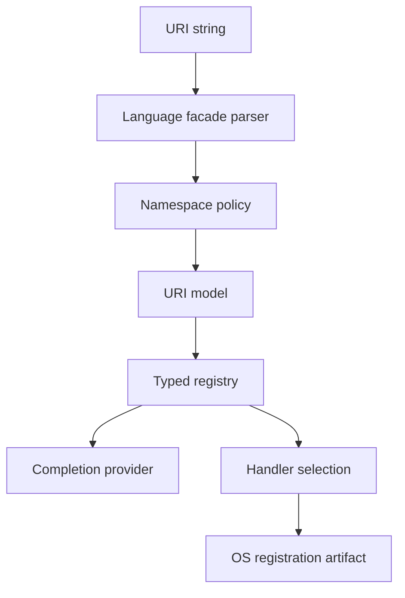

# cite Architecture

## Purpose

`cite` provides a small cross-language contract for:

- Parsing custom URI references.
- Registering typed URI parsers and completers.
- Generating and registering OS handlers.
- Keeping Go, TypeScript, Python, Rust, and PHP behavior aligned.

## Package Layout

```text
.
  go/        Go implementation
  ts/        TypeScript implementation
  py/        Python implementation
  rs/        Rust implementation
  php/       PHP implementation
  spec/      Shared fixtures and future proto/schema contracts
  docs/      Product, architecture, ADRs, specs, stories, personas
```

## Layers

| Layer | Responsibility | Notes |
| --- | --- | --- |
| Public facade | Parse, registry, completion, handler APIs | Idiomatic per language |
| Contract fixtures | Shared valid/invalid cases | Source of parity tests |
| Backend adapters | URL parser and OS handler dependencies | Replaceable without API break |
| OS renderer | macOS/Linux/Windows artifacts | Uses HandlerSpec |
| CI | Test all language ports | Blocks release drift |

## Core Flow



## Dependency Boundary

The public API must not expose implementation dependencies. Each language can
choose its best-supported URL parser and OS integration package behind a facade:

- Go: standard `net/url` where adequate plus OS-specific renderers.
- TypeScript: WHATWG `URL` or dependency-backed parser behind the facade.
- Python: `urllib.parse` or a better dependency behind the facade.
- Rust: `url` crate behind the facade.
- PHP: native parsing or maintained library behind the facade.

## Parity Model

All languages must pass the same fixture suite before release. Fixture drift is
treated as a product contract change, not a test-only change.

## Release Model

Release-please manages tags per component. The repo ships six
components — `poly-cite` (umbrella), `cite` (Go), and per-language
mirrors `cite-ts`/`cite-py`/`cite-rs`/`cite-php`. Each can release
independently; the umbrella `poly-cite` tracks meta changes.

Initial public release is `v0.1.0`.
